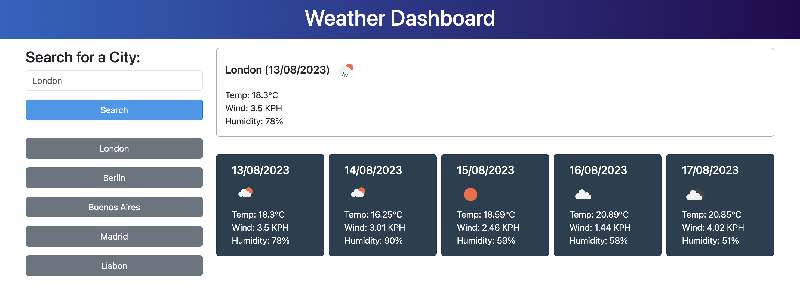

# Weather Dashboard

## Description

Submission for Module 8 of the University of Birmingham Skills Bootcamp in Front-End Web Development &amp; UX.

This assignment took a starter code package in commit [d6613e6](https://github.com/Stefan4D/weather-dashboard/commit/d6613e6341c012404c59bc77d0c97ab98a07fa54) and developed it to meet the defined acceptance criteria.

The production website is deployed [here](https://stefan4d.github.io/weather-dashboard/).

This has been developed to meet the following Acceptance Criteria:

- Create a weather dashboard with form inputs.
- When a user searches for a city they are presented with current and future conditions for that city and that city is added to the search history.
- When a user views the current weather conditions for that city they are presented with:
  - The city name
  - The date
  - An icon representation of weather conditions
  - The temperature
  - The humidity
  - The wind speed
- When a user views future weather conditions for that city they are presented with a 5-day forecast that displays:
  - The date
  - An icon representation of weather conditions
  - The temperature
  - The humidity
- When a user clicks on a city in the search history they are again presented with current and future conditions for that city.

## Learning Outcomes

- Revisited using Bootstrap components and utility classes including the built-in grid system
- Practiced using some JSDoc notation for commenting my JavaScript code, which I found very similar to NatSpec with Solidity
- I learned that storing Sets in localStorage doesn't work so need to convert to an array first and then convert back

## Resources used

- [MDN: Using Fetch](https://developer.mozilla.org/en-US/docs/Web/API/Fetch_API/Using_Fetch)
- [OpenWeatherMap Forecast5 API Docs](https://openweathermap.org/forecast5)
- [OpenWeatherMap Geocoding API Docs](https://openweathermap.org/api/geocoding-api#direct)
- [JSDoc: Getting Started](https://jsdoc.app/about-getting-started.html)
- [MDN: CSS Lineaar Gradient](https://developer.mozilla.org/en-US/docs/Web/CSS/gradient/linear-gradient)
- [Image Color Picker](https://imagecolorpicker.com/en)

## Mark Scheme Compliance

### Technical Acceptance Criteria

| Item                                                                                                                                                                          | Evidence                                                                                                                                                                                           |
| ----------------------------------------------------------------------------------------------------------------------------------------------------------------------------- | -------------------------------------------------------------------------------------------------------------------------------------------------------------------------------------------------- |
| Satisfies all of the above acceptance criteria plus the following:  -Uses the OpenWeather API to retrieve weather data.  -Uses localStorage to store persistent data. | The built application satisfies the acceptance criteria and uses the OpenWeather Forecast5 API as well as localStorage to store the search history as well as the most recently searched location. |

### Deployment

| Item                                              | Evidence                                                                    |
| ------------------------------------------------- | --------------------------------------------------------------------------- |
| Application deployed at live URL.                 | Live application deployed at: https://stefan4d.github.io/weather-dashboard/ |
| Application loads with no errors.                 | No visual defects   No console errors                                  |
| Application GitHub URL submitted.                 | URL submitted                                                               |
| GitHub repository that contains application code. | This repository contains all code.                                          |

### Application Quality

| Item                                                                                    | Evidence                                                                                                                                                                                             |
| --------------------------------------------------------------------------------------- | ---------------------------------------------------------------------------------------------------------------------------------------------------------------------------------------------------- |
| Application user experience is intuitive and easy to navigate.                          | Application user interface matches the mock-up and uses intuitive elements e.g. click on a history item to search again and remembering the last location searched for when visiting the site again. |
| Application user interface style is clean and polished.                                 | As above                                                                                                                                                                                             |
| Application resembles the mock-up functionality provided in the Challenge instructions. | Application resembles the mock-up. This includes colour-matching and applying the linear gradient to the header element.                                                                             |

### Repository Quality

| Item                                                                                                    | Evidence                                                                                                                                                                                                                  |
| ------------------------------------------------------------------------------------------------------- | ------------------------------------------------------------------------------------------------------------------------------------------------------------------------------------------------------------------------- |
| Repository has a unique name.                                                                           | Unique name used                                                                                                                                                                                                          |
| Repository follows best practices for file structure and naming conventions.                            | Standard file naming conventions used                                                                                                                                                                                     |
| Repository follows best practices for class/id naming conventions, indentation, quality comments, etc.  | All multi-word variables in JavaScript use camelCase   Indentation within code follows best practice    Comments have been included within the files to describe behaviour and/or intent of the code. |
| Repository contains multiple descriptive commit messages.                                               | Multiple commits included demonstrating incremental build of final submission. Each has a clear description of changes made.                                                                                              |
| Repository contains quality README file with description, screenshot, and link to deployed application. | This README document.                                                                                                                                                                                                     |

## License

Released under the MIT license. Full details in [LICENSE](./LICENSE).
